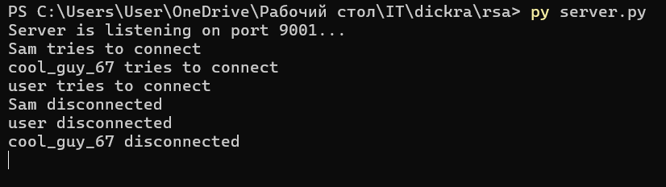
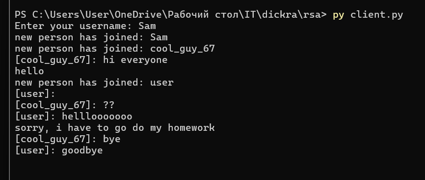
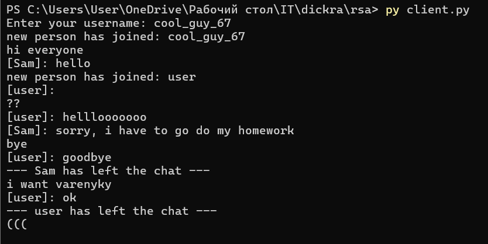
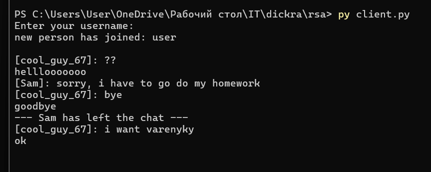

# RSA

Цей репозиторій містить реалізацію термінальної чат-програми з безпечною передачею повідомлень. Захист реалізовано за допомогою **гібридної системи** (RSA для обміну ключами + XOR для повідомлень) та **перевірки цілісності** (Message Integrity) за допомогою хешування.

---

## Інструкції до запуску

1. Відкрийте термінал та виконайте одну з команд:
```bash
python3 server.py
# або
py server.py
```

2. Відкрийте інше вікно терміналу (можна декілька для різних користувачів) та виконайте:
```bash
python3 client.py
# або
py client.py
```

3. Введіть ім'я користувача в консолі клієнта та почніть спілкуватися.
---

## Коротке пояснення імплементації

### RSA обмін ключами
Під час запуску клієнт самостійно генерує пару простих чисел та формує **публічний** `(e, n)` і **приватний** `(d, n)` ключі без використання сторонніх математичних бібліотек. Публічний ключ безпечно відправляється серверу.

### Гібридне шифрування
Сервер має секретний ключ та посимвольно шифрує його за допомогою публічного ключа клієнта за алгоритмом RSA:
> `C = M^e (mod n)`

Клієнт отримує зашифрований масив, розшифровує його своїм приватним ключем і отримує спільний `secret_key`.

### Кодування повідомлень
Для спілкування повідомлення кодуються за допомогою алгоритму **XOR**, використовуючи встановлений `secret_key`. Далі вони перетворюються у **HEX-формат** для уникнення втрати даних та безпечної передачі через сокети.

### Перевірка цілісності (Message Integrity)
Перед надсиланням повідомлення клієнт (або сервер під час `broadcast`) генерує хеш-суму оригінального тексту через `hashlib.sha256`.
- Дані надсилаються у спеціальному форматі: `hash|encrypted_message`.
- При отриманні приймач розшифровує повідомлення, рахує для нього новий хеш та порівнює з надісланим.
- Якщо хеші співпадають — повідомлення автентичне і дані під час передачі не змінювались.

## Скріншоти








